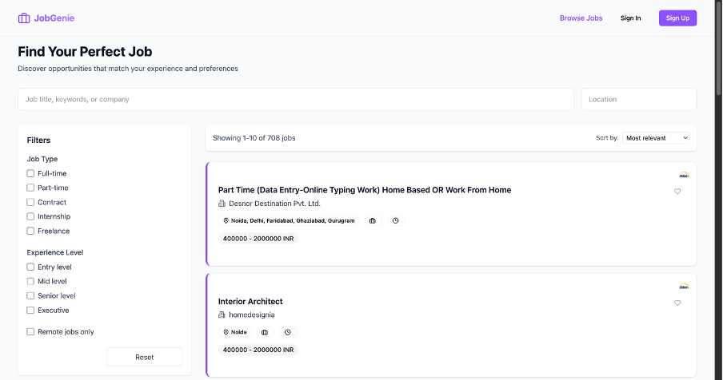
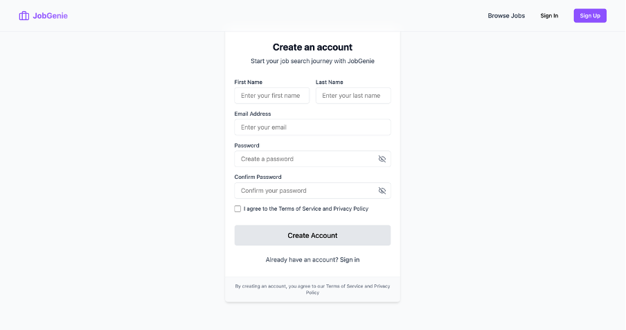
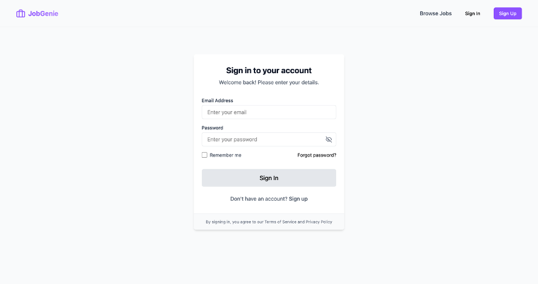

# JobGenie 🧞‍♂️ - Your All In One Job Search Assistant

JobGenie is a modern job search and application tracking platform built with React, TypeScript, and Node.js. It helps job seekers organize their job search process, track applications, and manage their professional profiles effectively.

## ✨ Features

- 🔍 Smart Job Search with filters and recommendations
- 📝 Application Tracking System
- 👤 Professional Profile Management
- 📄 Resume Builder
- 🎯 Job Preferences Configuration
- 🔐 Secure Authentication System

## 🖼️ Screenshots

### Home Page


### Job Browse Interface


### User Authentication



## 🛠️ Tech Stack

### Frontend
- React 18 with TypeScript
- Vite for build tooling
- TailwindCSS for styling
- Framer Motion for animations
- Radix UI for accessible components
- React Router for navigation
- Axios for API communication

### Backend
- Node.js with Express
- MongoDB with Mongoose ODM
- JWT for authentication
- Express Validator for input validation
- Rate limiting for API security
- CSV parser for job data seeding

## 🚀 Getting Started

### Prerequisites
- Node.js (v14 or higher)
- MongoDB
- Git

### Installation

1. Clone the repository
```bash
git clone https://github.com/yourusername/jobgenie.git
cd jobgenie
```

2. Install Frontend Dependencies
```bash
npm install
```

3. Install Backend Dependencies
```bash
cd backend
npm install
```

4. Configure Environment Variables
```bash
# In backend directory
cp .env.example .env
# Update the .env file with your MongoDB URI and JWT secret
```

5. Seed the Database
```bash
npm run seed
```

6. Start the Development Servers

For Backend:
```bash
# In backend directory
npm run dev
```

For Frontend:
```bash
# In root directory
npm run dev
```

## 🌟 Key Features in Detail

### Job Search and Filtering
- Advanced search capabilities
- Multiple filter options
- Real-time search results
- Job recommendations based on profile

### Application Tracking
- Track application status
- Store application history
- Set reminders for follow-ups
- Notes and communication history

### Profile Management
- Professional profile builder
- Skills and experience tracking
- Job preference settings
- Resume management

## 🔒 Security Features

- JWT-based authentication
- Password hashing with bcrypt
- Rate limiting for API endpoints
- Input validation and sanitization
- Protected routes and middleware

## 🤝 Contributing

Contributions are welcome! Please feel free to submit a Pull Request.

## 📝 License

This project is licensed under the ISC License.

## 🙏 Acknowledgments

- Built with modern web technologies
- Inspired by the need for a better job search experience
- Special thanks to all contributors